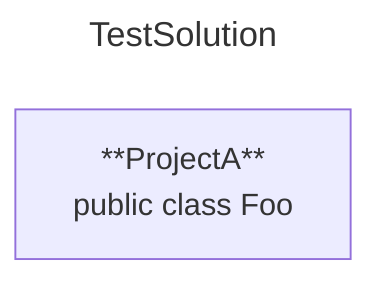
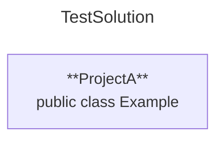
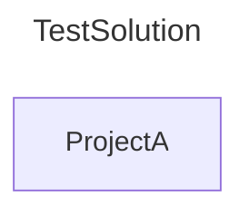

# Create Physical Project Diagram

## Description

**As a** developer,  
**I want** to automatically create a `.md` file at a specified output location,  
containing a code block, with a mermaid diagram that accurately represents the physical structure of my solution on disk,  
**So that** I can include it in my documentation with minimal effort

## CLI Usage

```shell
sharpmermaid generate-diagram --solution {string} --output {string} [--fileName {string}] [--topLevelPublicTypes {bool}] [--classDiagramLinks {bool}] [--baseUrl {string}]
```

**Required**:  

`--solution {pathToSolution}`: Path to the solution file (relative to the current directory)  

`--output {pathToOutput}`: Path to the generated `.md` file (relative to the current directory)  

**Optional**:  

`--fileName {string}`: Name of the generated .md file (without the .md extension)  
Default: "mermaid"

`--topLevelPublicTypes {bool}`: Whether to include top-level public types in each project
Default: `false`

`--classDiagramLinks {bool}`: Whether to include clickable URLs to a class diagram for each project  
The URL pattern for class diagram links is: `{baseUrl}/{FilePath}/{ProjectName}`  
It cannot be customized beyond this pattern
Default: `false`

`--baseUrl {string}`: Base URL to prepend to diagram links when `--classDiagramLinks` is enabled

## Rules

### Creating .md File

- If no `.md` file exists at the specified location, the system **must** create a new `.md` file and **must** display  
"Created new file '{fileName}.md' at '{path}'"  
[***see: scenario***](#creating-a-new-md-file)  

- If a `.md` file with the same name already exists at that location, the system **must** overwrite it and **must** display  
"Overwriting existing file at '{path}/{fileName}.md'"  
[***see: scenario***](#overwriting-an-existing-md-file)

- The created `.md` file:
  - **Must** start with mermaid code block fence
  - **Must** end with code block fence footer
  - **Must** have its first non-fence line start with graph
  - **Must** include a title that matches the solution name
  - **Must** include project nodes matching the project names
  - **May** include clickable URLs to class diagrams
  - **May** include top-level public types
  - **May** include project references between projects

### Configuration Resolution

- CLI-provided optional flags **must** override the `.sharpmermaidconfig.json` file  
[***see: scenario***](#cli-optionals-override-sharpmermaidconfigjson)

- If optional flags are not specified on the CLI,  
values **must** be taken from the `.sharpmermaidconfig.json` file located in the `pathToSolution` directory  
[***see: scenario***](#sharpmermaidconfigjson-used-for-optionals)  
  
- If neither the CLI nor the `.sharpmermaidconfig.json` file specifies an optional value,  
the system **must** fall back to default values  
[***see: scenario***](#defaults-used-for-missing-optionals)

### Error Handling
  
- If a `{required argument}` is not provided, the system **must** stop execution and **must** display:  
"Error: Missing required argument '{required argument}'"  
[***see: scenario***](#required-argument-missing)
  
- If the provided solution file does not exist, the system **must** stop execution and **must** display:  
"Error: Solution file not found at '{path}'. Please provide a valid path"  
[***see: scenario***](#invalid-solution-path)
  
- If the specified output path is invalid or inaccessible, the system **must** stop execution and **must** display:  
"Error: Unable to write to '{path}'. Ensure the directory exists and is writable"  
[***see: scenario***](#invalid-output-path)
  
- If the JSON config file is invalid, the system **must** stop execution and **must** display:  
"Error: Invalid configuration file at '{path}'. Please check the JSON format"  
[***see: scenario***](#invalid-sharpmermaidconfigjson)

- If `--classDiagramLinks` is true but no `--baseUrl` is provided, the system **must** stop execution and **must** display:  
"Error: Missing required argument 'baseUrl' when 'classDiagramLinks' is enabled. Please provide '--baseUrl {string}' or configure it in '.sharpmermaidconfig.json'"  
[***see: scenario***](#missing---baseurl-with---classdiagramlinks-enabled)

- If the specified output path {path} contains illegal characters, the system must stop execution and must display:  
"Error: The output path '{path}' contains illegal characters. Please provide a valid file path."  
[***see: scenario***](#illegal-characters-in-output-path)

- If the system cannot interpret the specified output path {path} as a valid file path, the system **must** stop execution and **must** display:  
"Error: The output path '{path}' is not a valid file path. Please provide a valid file path."  
[***see: scenario***](#invalid-output-path)

## Scenarios

---

### Creating a New .md File

Given the specified output path {path} exists and is writable
And no file named {fileName}.md exists at {path}
When the system executes the command
Then the system must create a new .md file named {fileName}.md at {path}
And the system must display:
"Created new file '{fileName}.md' at '{path}'"

---

### Overwriting an Existing .md File

Given the specified output path {path} exists and is writable
And a file named {fileName}.md already exists at {path}
When the system executes the command
Then the system must overwrite the existing {fileName}.md file with the new content
And the system must not create a backup of the old file
And the system must display:
"Overwriting existing file at '{path}/{fileName}.md'"

---

### CLI Optionals Override .sharpmermaidconfig.json

**Given** a solution TestSolution containing:

- ProjectA at `ProjectA/ProjectA.csproj`

- A file `Example.cs` in ProjectA with `public class Example {}`

**And** a `.sharpmermaidconfig.json` file exist in the solution with:

```json
{
  "includeUrls": false,
  "topLevelPublicTypes": false
}
```

**When** the developer runs:

```shell
sharpmermaid generate-diagram --solution ./TestSolution.sln --output ./diagram.md --includePublicTypes true
```

**Then** the generated `.md` file's code block includes public types:

~~~

~~~


---

### .sharpmermaidconfig.json Used for Optionals

**Given** a solution TestSolution containing:

- ProjectA at `ProjectA/ProjectA.csproj`

- A file `Example.cs` in ProjectA with `public class Example {}`

**And** a `.sharpmermaidconfig.json` file exist in the solution with:

```json
{
  "includeUrls": false,
  "topLevelPublicTypes": true
}
```

**When** the developer runs:

```shell
sharpmermaid generate-diagram --solution ./TestSolution.sln --output ./diagram.md
```

**Then** the generated `.md` file's code block includes public types:

~~~

~~~


---

### Defaults Used for Missing Optionals

**Given** a solution TestSolution containing:

- ProjectA at `ProjectA/ProjectA.csproj`

- A file `Example.cs` in ProjectA with `public class Example {}`

**And** no `.sharpmermaidconfig.json` file exist in the solution

**When** the developer runs:

```shell
sharpmermaid generate-diagram --solution ./TestSolution.sln --output ./diagram.md
```

**Then** the generated `.md` file's code block does not include public types:

~~~

~~~


---

### Required Argument Missing

**Given** a solution TestSolution

**When** the developer runs the command:

```shell
sharpmermaid generate-diagram
```

**Then** the system stops execution and displays an error message: `Error: Missing required argument '--solution'`

---

### Invalid Solution Path

**Given** no solution

**When** the developer runs the command:

```shell
sharpmermaid generate-diagram --solution ./NonExistent.sln
```

**Then** the system stops execution and displays an error message: `Error: Solution file not found at './NonExistent.sln'. Please provide a valid path`

---

### Invalid .sharpmermaidconfig.json

**Given** a JSON config file exists at ./config.json  
**And** the file content is not valid JSON  
**When** the developer runs:

```shell
sharpmermaid generate-diagram --solution ./TestSolution.sln --output ./diagram.md
```

**Then** the system stops execution  
**And** displays an error message: "Error: Invalid configuration file at ./config.json. Please check the JSON format"

---

### Optional Flags Provided Directly

**Given** no JSON config exists

**When** the developer runs:

```shell
sharpmermaid generate-diagram --solution ./TestSolution.sln --output ./diagram.md --includeUrls false --includePublicTypes true
```

**Then** the system generates a `.md` file at `./diagram.md`  
**And** the file’s content includes public types  
**And** does not include clickable URLs  
**And** the file’s content matches the expected output:

---

### Illegal Characters in Output Path

Given the specified output path {path} contains illegal characters (e.g., <>|:"?* on Windows)
When the system executes the command
Then the system must stop execution
And the system must display:
"Error: The output path '{path}' contains illegal characters. Please provide a valid file path."

---

### Invalid Output Path

Given the specified output path {path} is not a valid file path (e.g., references a device name like COM1 or is structurally invalid)
When the system executes the command
Then the system must stop execution
And the system must display:
"Error: The output path '{path}' is not a valid file path. Please provide a valid file path."

---

**Postcondition**:  
  - The file `MySolution.md` contains the up-to-date diagram.

---

### Missing --baseUrl with --classDiagramLinks enabled

**Given** a developer runs sharpmermaid generate-diagram --solution MySolution.sln --output diagram.md --classDiagramLinks true

There is no --baseUrl specified via CLI

The .sharpmermaidconfig.json in the solution directory does not include baseUrl

**When** The tool processes the command

**Then** the system must stop execution

The system must display the following error message:
"Error: Missing required argument 'baseUrl' when 'classDiagramLinks' is enabled. Please provide '--baseUrl {string}' or configure it in '.sharpmermaidconfig.json'"

No diagram file is created or modified

---

DU SKAL HUSKE AT INKLUDERE OVERWRITE EXISTING FILE {FILENAME OR PATH OR WHATEVER} ?

YES/NO: 