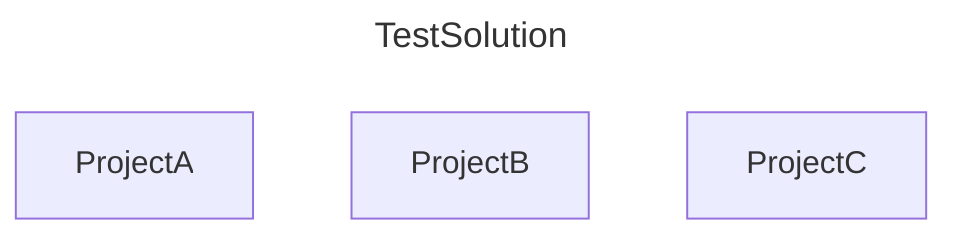
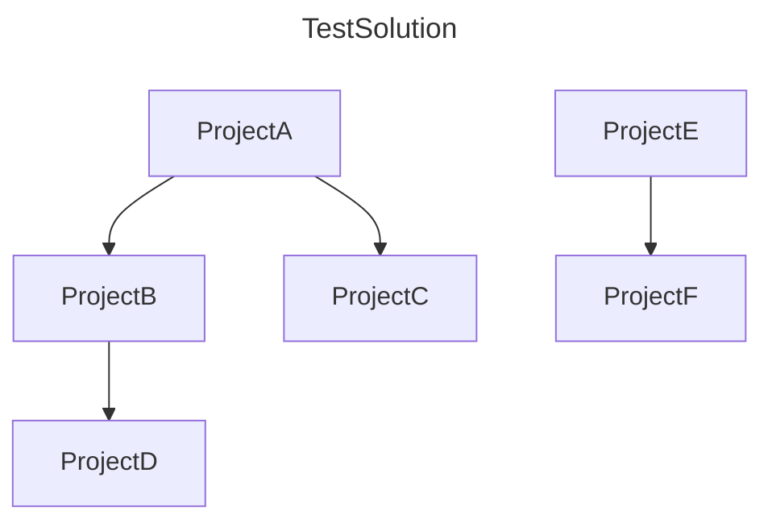
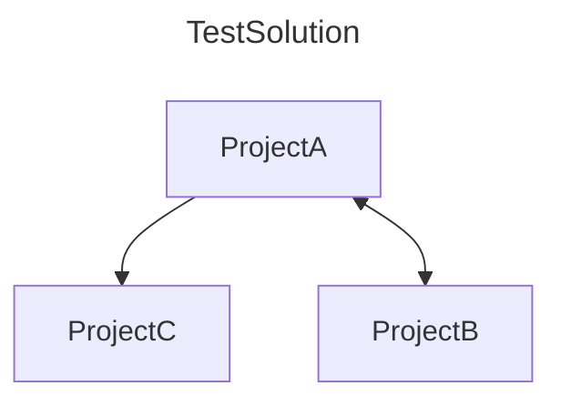
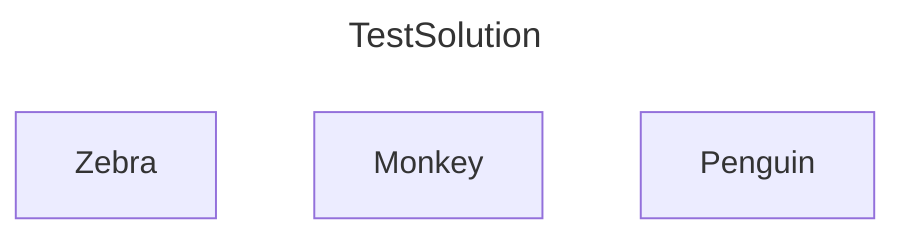
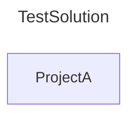
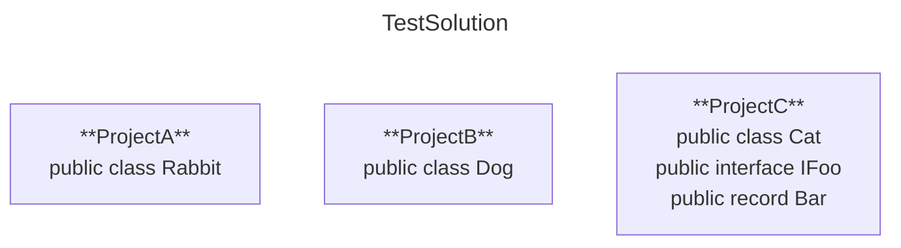

# **Generate Physical Project Diagram**

## **Description**

As a developer,  
I want to generate a diagram that reflects the solution structure on disk,  
and format it as a mermaid code block,  
So I can use it in a `.md` file

## **Rules**

- **Must** start with mermaid code block fence
- **Must** end with code block fence footer
- First non-fence line **must** begin with `graph`
- **Must** include a title same as the solution name
- **Must** include a project node for each project in the solution
- Individual project nodes **must** have the same name as the project
- Project nodes **may** include project references
- **May** include a clickable url to a projects class diagram
- **May** include projects top-level public types

## **Scenarios**

## Project References

### No Reference

**Given** a solution `TestSolution` containing:

- `ProjectA` at `ProjectA/ProjectA.csproj`
- `ProjectB` at `ProjectB/ProjectB.csproj`
- `ProjectC` at `ProjectC/ProjectC.csproj`

**When** I run the command:

```shell
sharpmermaid generate-diagram --solution ./TestSolution.sln`
```

from the solution directory

**Then** the output is:

~~~text

~~~


---

### One-Way Reference

**Given** a solution `TestSolution` containing:

- `ProjectA` at `ProjectA/ProjectA.csproj`
- `ProjectB` at `ProjectB/ProjectB.csproj`
- `ProjectC` at `ProjectC/ProjectC.csproj`
- `ProjectD` at `ProjectC/ProjectD.csproj`
- `ProjectE` at `ProjectC/ProjectE.csproj`
- `ProjectF` at `ProjectC/ProjectF.csproj`

**And** `ProjectA` has a project reference to `ProjectB` and `ProjectC`  
**And** `ProjectB` has a project reference to `ProjectD`  
**And** `ProjectE` has a project reference to `ProjectF`

**When** I run the command:

```shell
sharpmermaid generate-diagram --solution ./TestSolution.sln
```

from the solution directory

**Then** the output is:

~~~text

~~~


---

### Bi-Directional Reference

**Given** a solution `TestSolution` containing:

- `ProjectA` at `ProjectA/ProjectA.csproj`
- `ProjectB` at `ProjectB/ProjectB.csproj`
- `ProjectC` at `ProjectC/ProjectC.csproj`

**And** `ProjectA` has a project reference to `ProjectB` and `ProjectC`  
**And** `ProjectB` has a project reference to `ProjectA`

**When** I run the command:

```shell
sharpmermaid generate-diagram --solution ./TestSolution.sln
```

from the solution directory

**Then** the output is:

~~~text

~~~


---

## URLs Config

### Explicitly Enabled

**Given** a solution `TestSolution` containing:

- `Zebra`  at `Zebra/Zebra.csproj`
- `Monkey` at `Cage/Monkey/Monkey.csproj`  
- `Penguin` at `NorthPole/IceBlock/Penguin/Penguin.csproj`

**And** the base url is set to `https://example.com/`  

**When** I run the command:

```shell
sharpmermaid generate-diagram --solution ./TestSolution.sln --include-urls true
```

from the solution directory

**Then** the code block **must** include a clickable URL to each the projects class diagram  
**And** the URL **must** correctly reflect the project’s file path (if it's not at the root directory)  
**And** the output is:

~~~text

~~~


---

### Explicitly Disabled

**Given** a solution `TestSolution` containing:

- `ProjectA` at `ProjectA/ProjectA.csproj`

**And** a JSON config file exists with `IncludeUrls` set to `true`

**When** I run the command:

```shell
sharpmermaid generate-diagram --solution ./TestSolution.sln --include-urls false
```

***Then*** the generated diagram output **must not** contain any URLs
**And** the output is:
~~~text

~~~


---

### No Config (default behavior)

**Given** a solution `TestSolution` containing:

- `ProjectA` at `ProjectA/ProjectA.csproj`

**And** no CLI parameters for URLs are provided
**And** no JSON config file exists
**When** I run the command:

```shell
sharpmermaid generate-diagram --solution ./TestSolution.sln
```

**Then** the generated diagram output **must not** contain any URLs
**And** the output is:
~~~text

~~~


---

### JSON Fallback

**Given** a solution `TestSolution` containing:

- `ProjectA`  at `ProjectA/ProjectA.csproj`

**And** no CLI parameter for URLs are provided  
**And** a JSON config file exists with `IncludeUrls` set to `true`  
**And** the base url is set to `https://example.com/`  

**When** I run the command:

```shell
sharpmermaid generate-diagram --solution ./TestSolution.sln
```

from the solution directory

**Then** the code block **must** include a clickable URL for the projects class diagram  
**And** the output is:

~~~text

~~~


---

### JSON Not Found Fallback to Default

**Given** a solution `TestSolution` containing:

- `ProjectA` at `ProjectA/ProjectA.csproj`

**And** no CLI parameters for URLs are provided  
**And** no JSON config file exists

**When** I run the command:

```shell
sharpmermaid generate-diagram --solution ./TestSolution.sln
```

**Then** the generated diagram output **must not** contain any URLs  
**And** the output is:
~~~text

~~~


---

### CLI Overrides JSON Config

**Given** a solution `TestSolution` containing:

- `ProjectA` at `ProjectA/ProjectA.csproj`

**And** a JSON config file exists with `IncludeUrls` set to `false`  
**And** the base url is set to `https://example.com/`

**When** I run the command:

```shell
sharpmermaid generate-diagram --solution ./TestSolution.sln --include-urls true
```

**Then** the code block **must** include a clickable URL to the projects class diagram  
**And** the output is:
~~~text

~~~


---

## Public Types Config

### Explicitly Enabled

**Given** a solution `TestSolution` containing:

- `ProjectA` at `ProjectA/ProjectA.csproj`

- A file `Rabbit.cs` in `ProjectA` with:

```csharp
public class Rabbit {}
```

- A file `Dog.cs` in `ProjectB` with:

```csharp
public class Dog {}
internal class IFoo {}
private class Bar {}
class Baz {}
```

- A file `Cat.cs` in `ProjectC` with:

```csharp
public class Cat {}
public interface IFoo {}
public record Bar {}
```

**When** I run the command:

```shell
sharpmermaid generate-diagram --solution ./TestSolution.sln --include-public-types true
```

**Then** each node **must** list all public top-level types  
**And** the output is:
~~~text

~~~


### Explicitly Disabled

**Given** a solution TestSolution containing:

`ProjectA` at `ProjectA/ProjectA.csproj`

- A file `Rabbit.cs` in `ProjectA` with:

```csharp
public class Rabbit {}
```

**And** a JSON config file exists with `IncludePublicTypes: true`

When I run the command:

```shell
sharpmermaid generate-diagram --solution ./TestSolution.sln --include-public-types false
```

**Then** the generated diagram output must not contain any public types  
**And** the output is:
~~~
```mermaid
---
title: TestSolution
---
graph
    ProjectA
```
~~~

```mermaid
---
title: TestSolution
---
graph
    ProjectA
```

---

### No Config (Default Behavior)

**Given** a solution `TestSolution` containing:

- `ProjectA` at `ProjectA/ProjectA.csproj`

A file `PublicTypeExample.cs` in `ProjectA` with:

```csharp
public class Foo {}
And no CLI parameter or JSON config file is present
```

**When** I run the command:

```shell
sharpmermaid generate-diagram --solution ./TestSolution.sln
```

**Then** the generated diagram output must not contain any public types
**And** the output is:

~~~
```mermaid
---
title: TestSolution
---
graph
    ProjectA
```
~~~

```mermaid
---
title: TestSolution
---
graph
    ProjectA
```

---

### JSON Fallback

**Given** a solution `TestSolution` containing:

- `ProjectA` at `ProjectA/ProjectA.csproj`

A file `PublicTypeExample.cs` in `ProjectA` with:

```csharp
public class Foo {}
```

**And** a JSON config file exists with:

```json
{
  "IncludePublicTypes": true
}
```

**When** I run the command:

```shell
sharpmermaid generate-diagram --solution ./TestSolution.sln
```

**Then** the generated diagram output must include the public type Foo  
**And** the output is:

~~~
```mermaid
---
title: TestSolution
---
graph
    ProjectA["**ProjectA**
        public class Foo"]
```
~~~

```mermaid
---
title: TestSolution
---
graph
    ProjectA["**ProjectA**
        public class Foo"]
```

---

### JSON Not Found Fallback to Default

**Given** a solution `TestSolution` containing:

- `ProjectA` at `ProjectA/ProjectA.csproj`

**And** a file `PublicTypeExample.cs` in `ProjectA` with:

```csharp
public class Foo {}
```

**And** no JSON config file exists

**When** I run the command:

```shell
sharpmermaid generate-diagram --solution ./TestSolution.sln
```

**Then** the generated diagram output **must not** include any public types  
**And** the output is:

~~~
```mermaid
---
title: TestSolution
---
graph
    ProjectA
```
~~~

```mermaid
---
title: TestSolution
---
graph
    ProjectA
```

---

### CLI Overrides JSON Config


---

## Technical Notes

The URL pattern for clickable links is currently global, set to {baseUrl}/{FilePath}/{ProjectName}, and cannot be customized

## File Output Handling
### Save to .md file

Content of file matches in-memory diagram