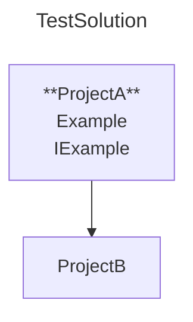

# Generate Physical Project Diagram

## Description

**As** a developer,  
**I want** to generate a Physical Project diagram from the `Diagrams` collection in `mermaidconfig.json`  
**So that** I get a visual representation of my project structure on disk.

## CLI Usage

```shell
dotnet sharpmermaid generate
```

[!include[config-structure](../snippets/config-structure.md)]

## Rules

### File Format

- **The created .mmd file**:
  - **Must** start with a title that matches the solution name
  - **Must** include a graph declaration
  - **Must** include project nodes matching the project names
  - **May** include clickable URLs to class diagrams
  - **May** include top-level public types
  - **May** include project references between projects

[***see: scenario***](#valid-mmd-file)

- **The created .md file**:
  - **Must** start with mermaid code block fence
  - **Must** end with code block fence footer
  - **Must** have its first non-fence line start with graph
  - **Must** include a title that matches the solution name
  - **Must** include project nodes matching the project names
  - **May** include clickable URLs to class diagrams
  - **May** include top-level public types
  - **May** include project references between projects

[***see: scenario***](#valid-md-file)

### Configuration

- If the provided solution file does not exist,  
  the system **must** stop execution and the console **must** display:  
  "Error: Solution file not found at '{path}'.  
  Please provide a valid path"  
  [***see: scenario***](#invalid-solution-path)

- If no file, with a specified `FileName` and `FileType` exists at `OutputDirectory`,  
  the system **must** create a new file with the specified `FileName` and `FileType` at `OutputDirectory`  
  and the console **must** display:  
  "Created new file '{FileName}{FileType}' at '{OutputDirectory}'"  
  [***see: scenario***](#creating-new-file)

- If a file with the same `FileName` and `FileType` already exists at `OutputDirectory`,  
  the system **must** overwrite it and the console **must** display:  
  "Overwriting existing file at '{OutputDirectory}/{FileName}{FileType}"  
  [***see: scenario***](#overwriting-existing-file)

- **Must** resolve `SolutionPath` and `OutputDirectory` by prioritizing `Diagrams` specific overrides
  - Use `Diagrams` specific values if present
  - Fall back to root-level values if not present

  [***see: scenario***](#json-config-fallback)

- If `ClassDiagramLinks` is enabled, `BaseUrl` is required  
  [***see: scenario***](#classdiagramlinks-enabled)

### Succes

- When a file is created the console **must** display:  
  Created new file '{FileName}{FileType}' at '{cwd}{OutputDirectory}'
  [***see: scenario***](#valid-mmd-file)

### Warnings

- If no projects are found in the solution, the console **must** display:  
  "{solution path}:  
  Warning: No projects found at '{SolutionPath}'"  
  [***see: scenario:***](#no-projects-found-in-solution)

- If no source files are found in a project, the console must display:  
  "{solution path}:  
  Warning: No .cs files found in '{project name}' at '{SolutionPath}'"  
  [***see: scenario:***](#no-source-files-found-in-project)

### Errors

- If `mermaidconfig.json` is not found in the current working directory, the console **must** display:
  "Error: Configuration file 'mermaidconfig.json' not found in the current directory"  
  [***see: scenario:***](#config-file-missing)

- If `mermaidconfig.json` is invalid, the console **must** display:
  "Error: Configuration file 'mermaidconfig.json' contains invalid JSON. Please fix the file and try again."  
  [***see: scenario:***](#invalid-json-in-config)

- If multiple diagrams have the same `FileName` and `OutputDirectory`, execution must stop and the console must display:  
  "Error: Multiple diagrams cannot have the same FileName '{FileName}' and OutputDirectory '{OutputDirectory}'. Please resolve the conflict."  
  [***see: scenario:***](#diagram-conflicts)

## Scenarios

---

### Creating New File

**Given** the developer’s current working directory is `{cwd}`  
**And** a solution file named `TestSolution.sln` is located at `{cwd}/TestSolution.sln`  
**And** the developer specifies the output directory `./Diagrams`  
**When** the developer runs:

```shell
sharpmermaid generate-diagram --solution ./TestSolution.sln --output ./Diagrams
```

**Then** the system must create a new `.md` file named `mermaid.md` at `{cwd}/Diagrams`  
**And** the console must display:
"Created new file '{fileName}' at '{solutionPath}/Diagrams'"

---

### Overwriting Existing File

Given the specified output path {path} exists and is writable
And a file named {fileName}.md already exists at {path}
When the system executes the command
Then the system must overwrite the existing {fileName}.md file with the new content
And the system must not create a backup of the old file
And the system must display:
"Overwriting existing file at '{path}/{fileName}.md'"

---

### Valid .mmd file

**Given** the developer’s current working directory is `{cwd}`  
**And** a solution file `TestSolution.sln` exists at `{cwd}/TestSolution.sln`  
**And** `./TestSolution` contains:

`ProjectA` at `./ProjectA/ProjectA.csproj`

- A file `ExampleA.cs` in `ProjectA` with `public class ExampleA {}`
- A file `IExampleA.cs` in `ProjectA` with `public interface IExampleA {}`

`ProjectB` at `./Folder1/ProjectB/ProjectB.csproj`

- A file `ExamplePrivate.cs` in `ProjectB` with `private class ExampleDefaultInternal {}`
- A file `ExampleDefaultInternal.cs` in `ProjectB` with `class ExampleDefaultInternal {}`
- A file `ExampleInternal.cs` in `ProjectB` with `class ExampleInternal {}`

**And** `ProjectA` has a reference to `ProjectB`

**And** a `sharpmermaidconfig.json` file exist in the solution with:

```json
{
  "SolutionPath": "./TestSolution.sln",
  "OutputDirectory": "./Diagrams",
  "Diagrams": [
    {
      "DiagramType": "PhysicalProject",
      "FileName": "PhysicalDiagram",
      "FileType": ".mmd",
      "TopLevelPublicTypes": true,
      "ClassDiagramLinks": true,
      "BaseUrl": "https://example.com/"
    }
  ]
}
```

**When** the developer runs:

```shell
dotnet sharpmermaid generate
```

**Then** the generated file **must** be created at `{cwd}/Diagrams/PhysicalDiagram.mmd`
**And** the console must display:  
Created new file 'mermaid.md' at '{cwd}/Diagrams/PhysicalDiagram.mmd'  
**And** the file **must** imclude:

- A title: TestSolution
- A graph declaration
- Project nodes: ProjectA and ProjectB
- Clickable URLs:  
  - https://example.com/ProjectA/ProjectA.csproj
  - https://example.com/Folder1/ProjectB/ProjectB.csproj
- Top-level public type in ProjectA:
  - `public class ExampleA`
  - `public interface IExampleA`
- An arrow from ProjectA to ProjectB

~~~
---
title: TestSolution
---
graph
    ProjectA["**ProjectA**
        Example"
        IExample]
    ProjectB
    ProjectA --> ProjectB
    click ProjectA "https://example.com/ProjectA/ProjectA.csproj"
    click ProjectB "https://example.com/Folder1/ProjectB/ProjectB.csproj"
~~~



---

### Valid .md file

Given

---

### Invalid Solution Path

Given

---

### Json Config Fallback

Given

---

### ClassDiagramLinks enabled

given

---

### No projects found in solution

Given, When, Then

---

### No source files found in project

Given, When, Then

---

### Diagram Conflicts

Given

---

### Config File Missing

Given no `mermaidconfig.json` file exists in `{cwd}`

**When** the developer runs:

```shell
dotnet sharpmermaid generate
```

**Then** the system must stop and display:
"Error: No 'mermaidconfig.json' file found in '{cwd}'"

---

### Invalid JSON in Config

**Given** an invalid JSON in mermaidconfig.json in `{cwd}`

**When** the developer runs:

```shell
dotnet sharpmermaid generate
```

**Then** the system must stop and display:
"Error: Invalid JSON in 'mermaidconfig.json'"

---

### Generate Diagram with Overrides

**Given** the developer’s current working directory is {cwd}
**And** a mermaidconfig.json file exists in {cwd} containing:
**And** a solution "TestSolution" containing:

- ProjectA at ProjectA/ProjectA.csproj

**And** a sharpmermaidconfig.json file exist in the solution with:

```json
{
  "SolutionPath": "./Solution.sln",
  "OutputPath": "./Diagrams",
  "DiagramType": "PhysicalProject",
  "PhysicalProject": {
    "OutputPath": "./Diagrams/Physical",
    "FileName": "PhysicalDiagram"
  }
}
```

**When** the developer runs: `dotnet sharpmermaid generate`

**Then** the system must generate a physical project diagram at {cwd}/Diagrams/Mermaid.mmd  
**And** the console must display:  
"Generated diagram: {cwd}/diagrams/mermaid.mmd"

---

### Generate Diagram Without Overrides

---

### Output in Markdown File

---
