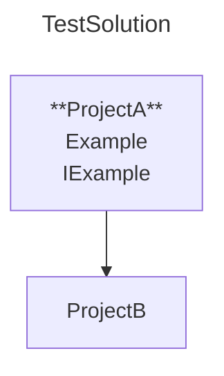

# Generate Physical Project Diagram

## Description

As a developer,  
I want to generate a Physical Project diagram from the `Diagrams` collection in `mermaidconfig.json`  
So that I get a visual representation of my project structure on disk.

## Dependencies

- ***<xref:cross-features.process-exit>***
- ***<xref:mermaidconfig.root>***
- ***<xref:mermaidconfig.physicalProjectDiagram>***

## Preconditions

- The file system is available with write access to `OutputDirectory`
- A valid `mermaidconfig.json` exists in the current working directory

## CLI Usage

```shell
dotnet sharpmermaid generate
```

## Rules

### The created .mmd file

- **Must** start with a title that matches the solution name
- **Must** include a graph declaration
- **Must** include project nodes matching the project names
- **May** include clickable URLs to class diagrams
- **May** include top-level public types
- **May** include project references between projects

[***see: scenario***](#valid-mmd-file)

### The created .md file

- **Must** start with mermaid code block fence
- **Must** end with code block fence footer
- **Must** have its first non-fence line start with graph
- **Must** include a title that matches the solution name
- **Must** include project nodes matching the project names
- **May** include clickable URLs to class diagrams
- **May** include top-level public types
- **May** include project references between projects

[***see: scenario***](#valid-md-file)

## Scenarios

---

### Valid .mmd file

**Given** the developer’s current working directory is `{cwd}`  
**And** a solution file `TestSolution.sln` exists at `{cwd}/TestSolution.sln`  
**And** `./TestSolution` contains:

`ProjectA` at `./ProjectA/ProjectA.csproj`

- A file `ExampleA.cs` in `ProjectA` with `public class ExampleA {}`
- A file `IExampleA.cs` in `ProjectA` with `public interface IExampleA {}`

`ProjectB` at `./Folder1/ProjectB/ProjectB.csproj`

- A file `ExamplePrivate.cs` in `ProjectB` with `private class ExampleDefaultInternal {}`
- A file `ExampleDefaultInternal.cs` in `ProjectB` with `class ExampleDefaultInternal {}`
- A file `ExampleInternal.cs` in `ProjectB` with `class ExampleInternal {}`

**And** `ProjectA` has a reference to `ProjectB`

**And** a `sharpmermaidconfig.json` file exist in the solution with:

```json
{
  "SolutionPath": "./TestSolution.sln",
  "OutputDirectory": "./Diagrams",
  "Diagrams": [
    {
      "DiagramType": "PhysicalProject",
      "FileName": "PhysicalDiagram",
      "FileType": ".mmd",
      "TopLevelPublicTypes": true,
      "ClassDiagramLinks": true,
      "BaseUrl": "https://example.com/"
    }
  ]
}
```

**When** the developer runs:

```shell
dotnet sharpmermaid generate
```

**Then** the generated file **must** be created at `{cwd}/Diagrams/PhysicalDiagram.mmd`
**And** the console must display:  
Created new file 'mermaid.md' at '{cwd}/Diagrams/PhysicalDiagram.mmd'  
**And** the file **must** imclude:

- A title: TestSolution
- A graph declaration
- Project nodes: ProjectA and ProjectB
- Clickable URLs:  
  - https://example.com/ProjectA/ProjectA.csproj
  - https://example.com/Folder1/ProjectB/ProjectB.csproj
- Top-level public type in ProjectA:
  - `public class ExampleA`
  - `public interface IExampleA`
- An arrow from ProjectA to ProjectB

~~~
---
title: TestSolution
---
graph
    ProjectA["**ProjectA**
        Example"
        IExample]
    ProjectB
    ProjectA --> ProjectB
    click ProjectA "https://example.com/ProjectA/ProjectA.csproj"
    click ProjectB "https://example.com/Folder1/ProjectB/ProjectB.csproj"
~~~



---

### Valid .md file

Given

---
