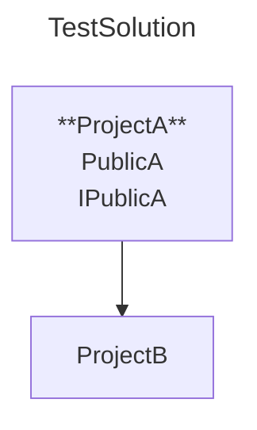

# Generate Physical Project Diagram

## Description

As a developer,  
I want to generate a Physical Project diagram from the `Diagrams` collection in mermaidconfig.json  
So that I get a visual representation of my project structure on disk.

## CLI Usage

```shell
dotnet sharpmermaid generate
```

## Dependencies

<xref:features.validate-sharpmermaidconfig>

## Preconditions

- The file system is available with write access
- A valid mermaidconfig.json exists in the current working directory:

```json
{
  "SolutionPath": "./TestSolution.sln",
  "OutputDirectory": "./Diagrams",
  "Diagrams": [
    {
      "DiagramType": "PhysicalProject",
      "FileName": "PhysicalDiagram",
      "FileType": ".mmd",
      "TopLevelPublicTypes": true,
      "ClassDiagramLinks": true,
      "BaseUrl": "https://example.com/"
    }
  ]
}
```

- A solution file `TestSolution.sln` exists at the root directory with the following structure:
  - `./ProjectA/ProjectA.csproj`
    - `PublicA.cs {public class PublicA}`
    - `IPublicA.cs {public interface IPublicA}`
    - `PrivateA.cs {private PrivateA}`

  - `./Folder1/ProjectB/ProjectB.csproj`
    - `PrivateB.cs {private PrivateB}`
    - `DefaultInternalB.cs {internal DefaultInternalB}`
    - `ExplicitInternalB.cs {internal ExplicitInternalB}`

  - `ProjectA` references `ProjectB`

### Valid .mmd file

In the following order:

- **Must** include a title that matches the solution name
- **Must** include a graph declaration
- **Must** include project nodes matching the project names
- **May** include clickable URLs to class diagrams
- **May** include top-level public types
- **May** include project references between projects

[***see: scenario***](#validate-mmd-file)

### Valid .md file

Same as .mmd file, but:

- **Must** start with mermaid code block fence
- **Must** end with code block fence footer

[***see: scenario***](#validate-md-file)

## Scenarios

---

### Validate .mmd file

Given the developer’s current working directory is {cwd}

When the developer runs: "dotnet sharpmermaid generate"

Then the generated file must be created at {cwd}/Diagrams/PhysicalDiagram.mmd  
And the file content must match:

~~~
---
title: TestSolution
---
graph
    ProjectA["**ProjectA**
        PublicA"
        IPublicA]
    ProjectB
    ProjectA --> ProjectB
    click ProjectA "https://example.com/ProjectA/ProjectA.csproj"
    click ProjectB "https://example.com/Folder1/ProjectB/ProjectB.csproj"
~~~



---

### Validate .md file

Given the developer’s current working directory is {cwd}  
And `FileType` is .md

When the developer runs: dotnet sharpmermaid generate

Then the generated file must be created at {cwd}/Diagrams/PhysicalDiagram.md  
And the file content must match:

~~~

~~~


---

### Display succes message after creating file

Given the developer’s current working directory is {cwd}

When the developer runs: dotnet sharpmermaid generate

Then the system the system must display:  
"Created new file 'PhysicalDiagram.mmd' at '{cwd}/Diagrams/PhysicalDiagram.mmd'"  
And the process must exit with code [0](<xref:cross-features.process-exit#0---success>)

---
